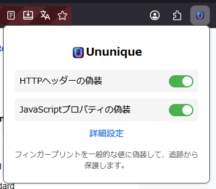
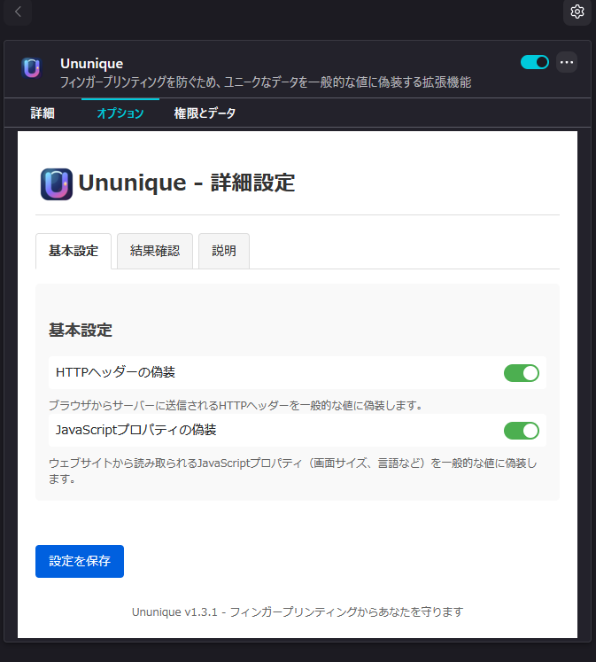

# Ununique Firefox拡張機能

Ununiqueは、Firefoxブラウザー向けのフィンガープリント対策拡張機能です。ユーザーを特定しやすい値を無関係な固定値へ雑に置き換えるのではなく、ブラウザーの種類・バージョン、HTTPヘッダー、JavaScriptから見える値を一貫した一般的なプロファイルへ正規化します。

## 主な機能

- **一貫した正規化**: User-Agentのブラウザー系列・バージョンを保ちつつプラットフォームを共通化し、画面サイズ・CPU・メモリを一般的なバケットへ丸めます。
- **HTTPとJavaScriptの整合**: User-Agent、Accept-Language、DNT、Client Hintsと、ページから見えるnavigator値を同じプロファイルから生成します。Referer、キャッシュ、Upgradeヘッダーは勝手に書き換えません。
- **Canvas / WebGL対策**: ドキュメントごとの短命なCanvasノイズ、WebGLのベンダー・レンダラー正規化、デバッグ拡張の非表示を行います。
- **保護モード**: バランスモードは互換性を優先し、厳格モードでは音声計測、フォント、メディアデバイス、通常のWorkerも追加でマスクします。
- **安全な切り替え**: 設定を無効化したときは、保存した元のプロパティ記述子へ戻します。設定と処理はローカルに留まります。
- **多言語UI**: 日本語・英語を含む15ロケールのUIと、AMO掲載情報を用意しています。一部の詳細文は既定ロケールへフォールバックします。

## インストール方法

### リリースからインストール

1. [Githubのリリースページ](https://github.com/roflsunriz/ununique/releases)から最新の`.xpi`ファイルをダウンロードします。
2. Firefoxを開き、メニューから「アドオン」を選択します。
3. 歯車アイコンをクリックし、「ファイルからアドオンをインストール」を選択します。
4. ダウンロードした`.xpi`ファイルを選択してインストールします。

### 開発版をインストール

開発版をインストールするには：

1. このリポジトリをクローンするか、ZIPファイルとしてダウンロードして展開します。
2. Firefoxを開き、アドレスバーに `about:debugging` と入力します。
3. 「一時的なアドオン」タブを選択し、「一時的なアドオンを読み込む」をクリックします。
4. 展開したフォルダ内の `manifest.json` ファイルを選択します。

## 使用方法

インストール後、Firefoxのツールバーに拡張機能のアイコンが表示されます。

- **クイック設定**: アイコンをクリックすると、HTTPヘッダーとJavaScript値の保護を個別に有効/無効にできます。
- **詳細設定**: 「詳細設定」リンクから、バランス／厳格モードを選択し、元の値と正規化後の値、Canvasノイズの検査結果を確認できます。

## プライバシーポリシー

この拡張機能は、ユーザーのデータを収集したり、外部サーバーに送信したりすることはありません。すべての処理はローカルで行われ、設定もローカルに保存されます。

## 貢献方法

1. このリポジトリをフォークします。
2. 新しいブランチを作成します: `git checkout -b my-new-feature`
3. 変更をコミットします: `git commit -am 'Add some feature'`
4. ブランチにプッシュします: `git push origin my-new-feature`
5. プルリクエストを送信します。

## ライセンス

このプロジェクトはMITライセンスの下で公開されています。詳細については、[LICENSE](LICENSE)ファイルを参照してください。

## 注意事項

フィンガープリンティング技術は常に進化しており、この拡張機能がすべての追跡や識別を防止することは保証できません。厳格モードでは、WebRTC、音声、フォント、Workerを利用するサイトの互換性が下がる場合があります。ログイン状態、Cookie、IPアドレス、OSやネットワークの外部観測値はこの拡張機能だけでは隠せません。問題が起きたサイトは、モードをバランスへ戻すか、Issueで再現手順を共有してください。
